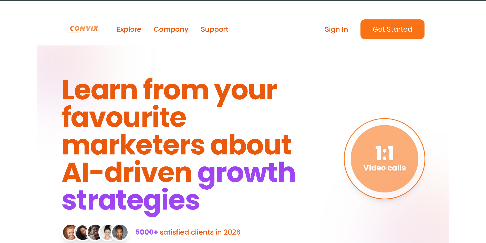
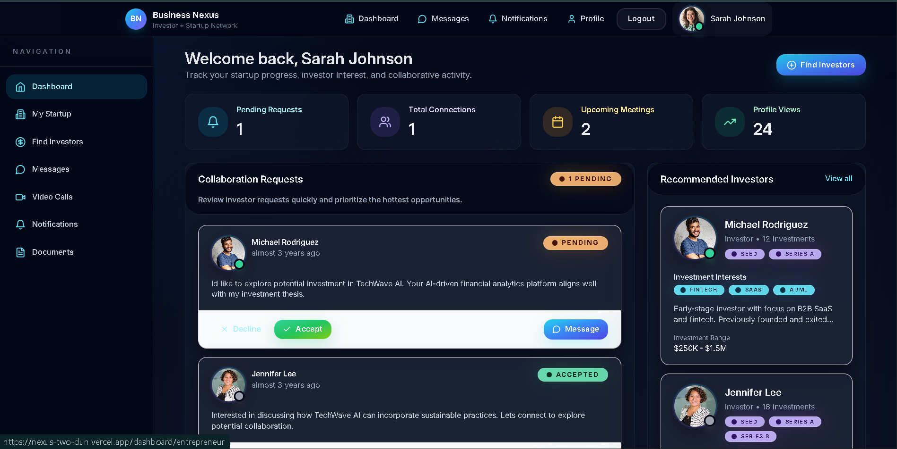

<h1 align="center">Hi 👋, I'm Sana Parveen</h1>

<h3 align="center">
💻 Full-Stack Developer | 🎓 BSCS Student | 🚀 Future Software Engineer
</h3>

Passionate about building modern, scalable, and user-friendly web applications while continuously learning software engineering, full-stack development, problem-solving, and emerging technologies.

  

  

  

  

  

---

# 🚀 About Me

🎓 BSCS Student passionate about Software Engineering and Web Development.

💻 Full-Stack Developer focused on building responsive, scalable, and user-friendly web applications.

🧠 Strengthening problem-solving skills through Data Structures & Algorithms.

🌱 Continuously learning software engineering principles, backend development, and modern web technologies.

🔭 Building real-world projects to improve technical expertise and practical experience.

🎯 Interested in Full-Stack Development, Software Engineering, System Design, and Scalable Applications.

⚡ Goal: To become a highly skilled Software Engineer capable of creating impactful digital products.

---
# 🛠️ Tech Stack & Skills

### 🎨 Frontend Development

### ⚙️ Backend Development

### 🗄️ Database

  

### 💻 Programming Languages

### 🧰 Tools & Platforms

### 🚀 Additional Skills

---

# 💼 Featured Personal Projects

<table>
<tr>
<td width="50%">

### 🚀 Convix – SaaS Landing Page

Modern SaaS Landing Page with responsive design and engaging UI.
<a href = "https://convixsaaslanding.netlify.app/">Live demo</a>
**Features**
- Responsive Design
- Interactive Components
- Modern UI/UX
- Mobile Friendly
- Fast Performance

**Tech Stack**

`React` `JavaScript` `Tailwind Css`

</td>

<td width="50%">

### 🤝 Nexus – Connect Entrepreneurs & Investors

Platform connecting entrepreneurs with investors.
<a href = "https://nexus-two-dun.vercel.app/">Live demo </a>
**Features**
- Startup Showcase
- Investor Discovery
- Networking
- Business Opportunities
- Entrepreneur Profiles

**Tech Stack**

`React` `TypeScript`

</td>
</tr>

<tr>
<td width="50%">

### 🛡️ TruthGuard – Scam & Fraud Prevention Platform

Awareness platform focused on online safety.
<a href = "https://truthguard12.pythonanywhere.com/">live demo </a>
**Features**
- Scam Detection
- Fraud Reporting
- User Education
- Safety Resources
- Awareness Campaigns

**Tech Stack**

`JavaScript` `Django` `Sqlite` `Tailwind CSS`

</td>

<td width="50%">
  
### ResQNet | Disaster Relief & Emergency Response Platform,

Awareness platform focused on online safety.
<a href = "https://theresqnet.netlify.app/">live demo </a>
**Features**
- Report Disasters
- Shelters
- Missing persons
- Announcements
- Awareness Campaigns
- Volunteer Registration & Management
**Tech Stack**

`JavaScript` `tailwincss` `html` 

</td>

<td width="50%">
  
</tr>
<tr>
### 🚀 More Projects Coming Soon

Building exciting Full-Stack Applications and Software Engineering Projects.

</td>
</tr>
</table>

---

# 📊 GitHub Statistics

  
  
  

  

---

# 🏆 GitHub Trophies

---

# 📈 Contribution Graph

---

# 🐍 Contribution Snake

---

# 🌟 Fun Facts

💻 Love Building Real-World Projects

📚 Lifelong Learner

🚀 Passionate About Software Engineering

🎯 Focused On Continuous Growth

🌱 Exploring New Technologies Every Day

---

# 🤝 Let's Connect

  

  

  

---

⭐ <b>Building Today, Learning Every Day, Engineering the Future.</b> ⭐

