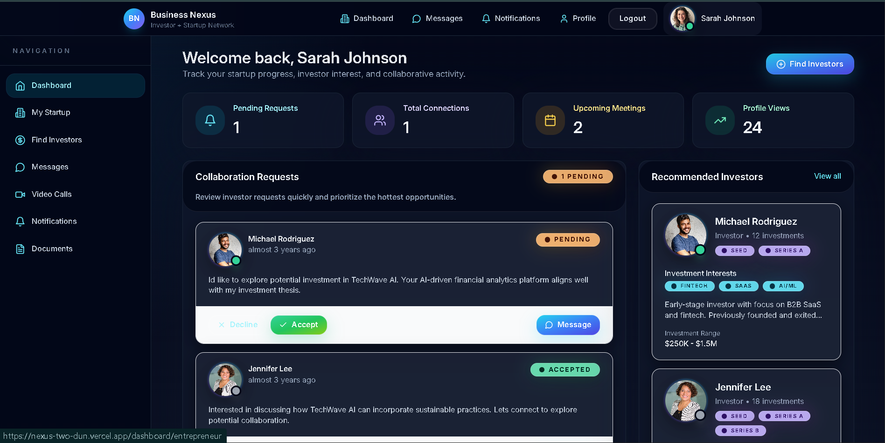

<div align="center">


# Hi, I'm Sana Parveen 👋


<p>
  
  
  
</p>

<p>
  <a href="mailto:sanaparveen.dev@gmail.com"></a>
  <a href="https://linkedin.com/in/sanaparveen89"></a>
  <a href="https://github.com/SANAPARVEEN-cmd"></a>
</p>

<p>
  <a href="#-about-me">About</a> •
  <a href="#️-tech-stack--skills">Tech Stack</a> •
  <a href="#-featured-projects">Projects</a> •
  <a href="#-github-stats">Stats</a> •
  <a href="#-lets-connect">Contact</a>
</p>

</div>

<br/>

## 📌 About Me

- 🎓 BSCS student with a **4.0 GPA**, passionate about software engineering and web development
- 💼 Currently interning as a **Web Developer at Arch Technologies** (remote), working with React.js, Tailwind CSS, and Git/GitHub
- 💻 Full-stack developer focused on building responsive, scalable, and user-friendly web applications
- 🧠 Sharpening problem-solving skills through Data Structures & Algorithms and database coursework
- 🔭 Building real-world projects to grow technical expertise and interview readiness
- 🎯 Interested in full-stack development, system design, and scalable applications
- ⚡ Goal: become a highly skilled software engineer who ships impactful digital products

<br/>

## 🛠️ Tech Stack & Skills

**Frontend**


**Backend & Databases**


**Languages**


**Tools & Platforms**


**Core Competencies**

<p>


</p>

<br/>

## 💼 Featured Projects

<table>
<tr>
<td width="50%" valign="top">

### 🚀 Convix — SaaS Landing Page


Modern SaaS landing page with responsive design and engaging UI.

**Highlights:** Responsive design · Interactive components · Modern UI/UX · Mobile-friendly · Fast performance

`React` `JavaScript` `Tailwind CSS`

🔗 [Live Demo](https://convixsaaslanding.netlify.app/)

</td>
<td width="50%" valign="top">

### 🤝 Nexus — Connect Entrepreneurs & Investors


Platform connecting entrepreneurs with investors.

**Highlights:** Startup showcase · Investor discovery · Networking · Business opportunities · Entrepreneur profiles

`React` `TypeScript`

🔗 [Live Demo](https://nexus-two-dun.vercel.app/)

</td>
</tr>
<tr>
<td width="50%" valign="top">

### 🛡️ TruthGuard — Scam & Fraud Prevention Platform


Awareness platform focused on online safety.

**Highlights:** Scam detection · Fraud reporting · User education · Safety resources · Awareness campaigns

`JavaScript` `Django` `SQLite` `Tailwind CSS`

🔗 [Live Demo](https://truthguard12.pythonanywhere.com/)

</td>
<td width="50%" valign="top">

### 🌐 ResQNet — Disaster Relief & Emergency Response


Front-end platform for disaster relief and emergency coordination.

**Highlights:** Report disasters · Shelter listings · Missing persons · Announcements · Volunteer registration

`JavaScript` `Tailwind CSS` `HTML`

🔗 [Live Demo](https://theresqnet.netlify.app/)

</td>
</tr>
</table>

<div align="center">

🚧 **More full-stack and software engineering projects coming soon** 🚧

</div>

<br/>

## 📊 GitHub Stats

<div align="center">


<br/>


</div>

> **Note:** GitHub's stats/streak widgets are hosted on shared free servers and can occasionally rate-limit or lag by a day — that's normal for these community tools, not a problem with your profile.

<br/>

## 🏆 GitHub Trophies

<div align="center">

</div>

<br/>

## 📈 Contribution Activity

<div align="center">

</div>

<br/>

## 🐍 Contribution Snake

<div align="center">

<picture>
  <source media="(prefers-color-scheme: dark)" srcset="https://raw.githubusercontent.com/SANAPARVEEN-cmd/SANAPARVEEN-cmd/output/github-contribution-grid-snake-dark.svg" />
  
</picture>

</div>

> **Why this one wasn't showing before:** the old link pointed to Platane's own demo repo, not yours — so it could never reflect your contributions. The snake has to be generated *in your own* special `SANAPARVEEN-cmd/SANAPARVEEN-cmd` repository via a GitHub Action. One-time setup:
>
> 1. Create a repo named exactly `SANAPARVEEN-cmd` (same as your username) if you don't have one yet — that's your special profile repo.
> 2. Add this file at `.github/workflows/snake.yml`:
>
> ```yaml
> name: Generate Snake
> on:
>   schedule:
>     - cron: "0 0 * * *"
>   workflow_dispatch:
>   push:
>     branches: [ main ]
> jobs:
>   generate:
>     runs-on: ubuntu-latest
>     steps:
>       - uses: Platane/snk@v3
>         with:
>           github_user_name: SANAPARVEEN-cmd
>           outputs: |
>             dist/github-contribution-grid-snake.svg
>             dist/github-contribution-grid-snake-dark.svg?palette=github-dark
>       - uses: crazy-max/ghaction-github-pages@v4
>         with:
>           target_branch: output
>           build_dir: dist
>         env:
>           GITHUB_TOKEN: ${{ secrets.GITHUB_TOKEN }}
> ```
>
> 3. Run the workflow once manually (Actions tab → Generate Snake → Run workflow). After that it refreshes daily and the image above will render your real contribution graph.

<br/>

## 🌟 Fun Facts

<p align="center">


</p>

<br/>

## 🤝 Let's Connect

<div align="center">

<a href="mailto:sanaparveen.dev@gmail.com"></a>
<a href="https://linkedin.com/in/sanaparveen89"></a>
<a href="https://github.com/SANAPARVEEN-cmd"></a>

<br/><br/>

⭐ **Building today, learning every day, engineering the future.** ⭐

</div>
